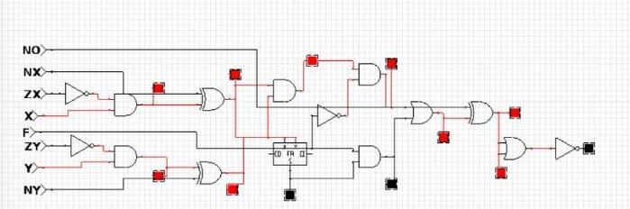
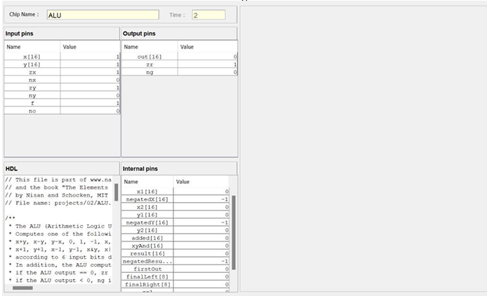
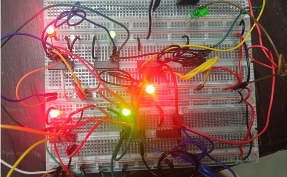
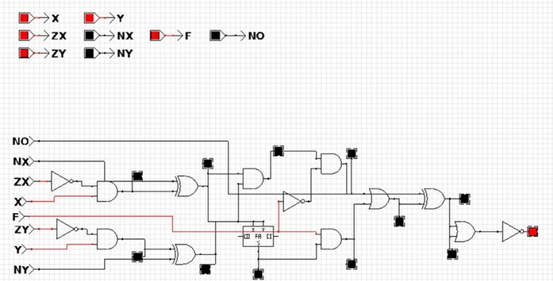

# Hack-ALU: A 16-Bit Arithmetic Logic Unit

This repository contains the complete project files for a 16-bit Hack Arithmetic Logic Unit (ALU), a core component of the Hack computer architecture. The project was completed as part of a course on the fundamental principles of computing. This project showcases the design and implementation of a core CPU component, from foundational logic gates to a functional, 16-bit computational unit.

---

## 🏷️ Tags

`computer-architecture`, `digital-logic`, `ALU`, `Nand2Tetris`, `hardware-simulation`, `circuit-design`, `16-bit`

---

## 🛡️ Badges

[]()
[](https://opensource.org/licenses/MIT)

---

## 📝 Project Overview

The 16-bit Hack ALU is a versatile digital circuit designed to perform a wide array of arithmetic and logical operations on two 16-bit inputs, `x` and `y`. Its functionality is controlled by a set of six control bits (`zx`, `nx`, `zy`, `ny`, `f`, `no`), which determine the specific operation to be performed. This design demonstrates the elegance of a minimalistic, control-bit-driven approach to computer architecture.

The ALU also provides two crucial status flags:
- `zr` (zero): Set to `1` if the output of the operation is zero.
- `ng` (negative): Set to `1` if the output is negative (i.e., its most significant bit is `1`).

These flags are essential for enabling conditional operations and control flow, which are vital for programming and decision-making within the Hack computer.

---

## ⚙️ How It Works

The ALU's operation is dictated by its six control bits. These bits are hardwired to specific components within the circuit, allowing a single 16-bit computation to be controlled by a small set of instructions.

-   **Input Manipulation (`zx`, `nx`, `zy`, `ny`):** Before any calculation, the inputs `x` and `y` can be zeroed out (`zx`, `zy`) or negated (`nx`, `ny`) using multiplexers. This allows for flexible manipulation of the input values.
-   **Function Selection (`f`):** The `f` bit acts as a selector for the main operation. If `f=1`, the ALU performs addition (`x + y`). If `f=0`, it performs a bitwise AND (`x & y`).
-   **Output Negation (`no`):** The final output of the calculation can be negated if the `no` bit is set to `1`. This provides the ability to perform operations like `x+1` or `!x`.
-   **Status Flags (`zr`, `ng`):** The `zr` and `ng` flags are generated by inspecting the final output. The `zr` flag checks if all 16 bits of the output are zero, and the `ng` flag checks the most significant bit (MSB) to determine if the result is negative.

This combination of control bits allows for a total of 18 different operations, including `0`, `1`, `-1`, `x`, `y`, `!x`, `!y`, `x+1`, `y+1`, `x-1`, `y-1`, `x+y`, `x-y`, `y-x`, `x&y`, `x|y`, `!x`, and `!y`.

---

## 🔬 Results

The successful design and implementation of the Hack ALU were verified through both software simulation and physical hardware testing. The results confirmed that the ALU correctly performed all 18 specified operations based on the control bit inputs. The status flags were also validated, accurately reflecting whether the output was zero or negative.

The project demonstrated a robust understanding of digital logic principles and the ability to translate a theoretical design into a functional circuit, a fundamental skill in computer architecture.

---

## 🖼️ Implementation and Design

The Hack ALU was implemented using both software and hardware methodologies. The circuit was designed and simulated using the [CEDAR Logic Simulator](https://www.cedarlogic.com/) and the Nand2Tetris [Hardware Simulator](https://www.nand2tetris.org/).

The physical implementation involved assembling the circuit on a breadboard using fundamental digital components:
-   **Multiplexers:** SN74LS153N for signal selection and routing.
-   **Logic Gates:** 74LS08N (AND), 74LHC86N (XOR), 74LS04N (NOT), and 74F32N (OR) for performing core logical and arithmetic operations.

Below are images extracted from the project report, showcasing the hardware and software aspects of the implementation.

### Key Diagrams from the Project Report

| Diagram Title | Image |
| :--- | :---: |
| **Circuit Diagram** |  |
| **Hardware Simulation - Nand2Tetris** |  |
| **Hardware Implementation** |  |
| **Software Simulation - CEDAR logic** |  |

---

## 🚀 Future Scope

The design of the Hack ALU provides a solid foundation for future enhancements and expansions. Potential future work includes:

1.  **Increased Bit Width:** Expanding the ALU to support 32-bit or 64-bit operations to handle larger data sets.
2.  **Additional Operations:** Integrating more complex operations like multiplication and division.
3.  **Improved Efficiency:** Optimizing the circuit design to reduce power consumption and increase processing speed.
4.  **Error Detection:** Implementing basic error detection mechanisms, such as parity checks, to ensure data integrity.
5.  **Educational Resources:** Developing interactive tools and comprehensive documentation to serve as a resource for students and hobbyists.

---

## ⚙️ Getting Started

To explore the project, simply clone this repository:

```sh
git clone [https://github.com/your-username/Hack-ALU.git](https://github.com/your-username/Hack-ALU.git)
cd Hack-ALU
```

The full detailed project report is available in the `docs` directory: [`EOC_Report.pdf`](./docs/EOC_Report.pdf)

---

## 📝 License

This project is licensed under the MIT License.
